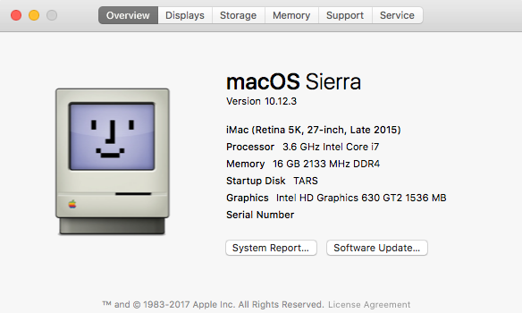

# My Hackintosh build
* [Hardware](./docs/hardware.md)
* [Setup](./docs/setup.md)
* [Troubleshoot](./docs/troubleshoot.md)
* [Reference](./docs/reference.md)

# Hackintosh?
Apple's overpriced offering is moving away from modular, upgradable hardware. Some recent unveils of the iMac, Mac Pro, and MacBook Pro failed to meet the expectations of many professionals that demand improved computer specs. Using the more powerful hardware available with macOS can be the ultimate environment for a developer--unix coupled with strong machinery. For example, at the time of writing this, I'm on my Kaby Lake build, but current Apple hardware doesn't offer the newest Intel generation.

Should you build a hackintosh? Probably not. There's a lot of troubleshooting and tinkering involved. But if you're okay with that, then try it out! Check out reddit.com/r/hackintosh, tonymacx86.com and insanelymac.com to start.

